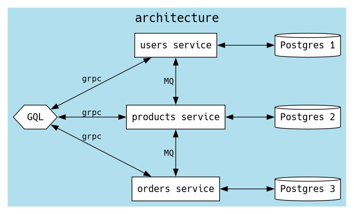
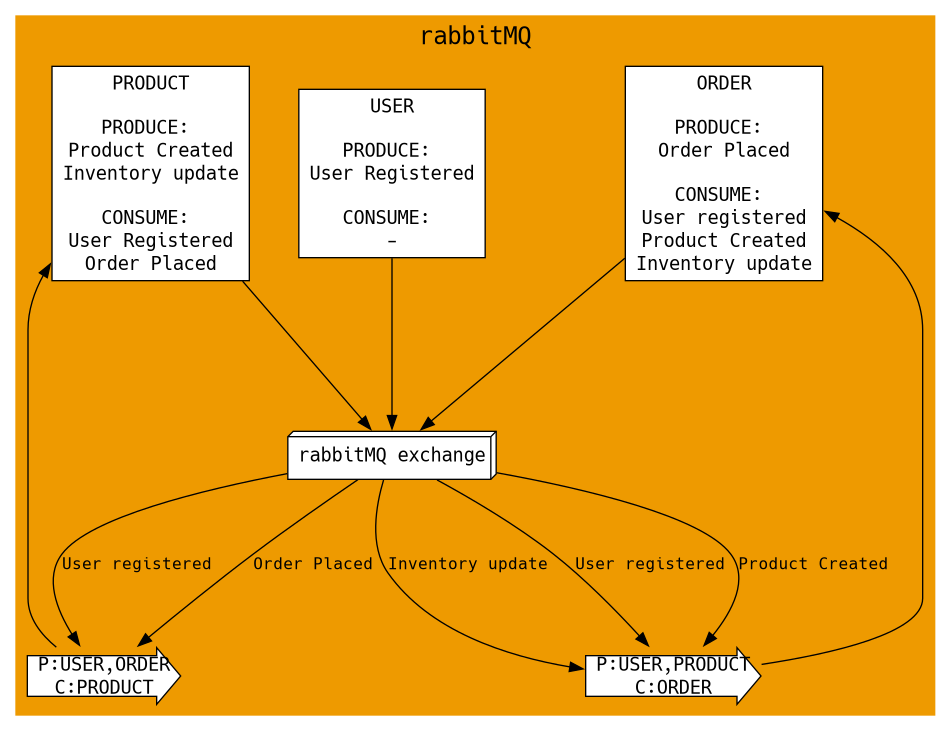

# Microservices

This is a monorepo containing code for microservices pertaining to an ecommerce webapp

- [Installation](#installation)
- [Description](#description)
  - [GraphQL API](#1-graphql-api)
  - [Users Service](#2-users-service)
  - [Products Service](#3-products-service)
  - [Orders Service](#4-orders-service)
- [Architecture](#architecture)
- [Todos](#todos)

## Installation

1. Ensure that you have Golang and Docker installed

2. Clone and cd into the repo

   ```bash
   git clone https://github.com/ary82/microservices.git
   cd microservices
   ```

3. Either start everything with docker compose

   ```bash
   docker compose up -d

   # Navigate to http://localhost:8080 for GraphQL playground
   ```

   **OR** Only start the dependencies with docker

   ```bash
   # Start the dependencies
   docker compose -f ./docker-compose-dev.yml up -d

   # Copy the .env
   cp .env.example .env

   # Start each service
   make run-api
   make run-user
   make run-product
   make run-order

   # Navigate to http://localhost:8001 for GraphQL playground
   ```

## Description

This repo contains the following microservices with careful design practices. Their entrypoints are in `cmd/` and their logic is in their independent directories in `internal/`. They use two common packages:

- `mq`(location: `internal/mq`), contains types needed for data exchange in Message Queues
- `proto`(location: `internal/proto`), contains `.proto` files and generated code for grpc

### 1. GraphQL API

This is the GraphQL API that will be exposed to the client, fetching and aggregating data from all three microservices.
Uses grpc to interact with the three microservices to fetch and change data.

Supports the following queries:

```graphql
query {
  users {
    id
    username
    email
    type # 0 - DEFAULT, 1 - ADMIN
  }
  products {
    id
    name
    description
    price
    stock
  }
  orders {
    id
    user_id
    price_total
    quantity
  }
}
```

Single item queries can be made with `id` argument:

```graphql
query {
  user(id: "ID_STRING") {
    id
    username
    email
    type # 0 - DEFAULT, 1 - ADMIN
  }
  product(id: "ID_STRING") {
    id
    name
    description
    price
    stock
  }
  order(id: "ID_STRING") {
    id
    user_id
    price_total
    quantity
    order_products {
      product_id
      quantity
      price
    }
  }
}
```

Following mutations are possible:

```graphql
mutation {
  registerUser(
    input: {
      email: "EMAIL"
      username: "USERNAME"
      type: 0 # 0 - DEFAULT, 1 - ADMIN
      password: "PASSWORD"
    }
  ) {
    id
    email
    username
    type # 0 - DEFAULT, 1 - ADMIN
  }
}
```

```graphql
mutation {
  login(input: { email: "EMAIL", password: "PASSWORD" }) {
    token # JWT: put in Authorization Header
  }
}
```

```graphql
# Only applicable when user is logged in
mutation {
  placeOrder(
    input: { order_products: [{ product_id: "PRODUCTID", quantity: 1 }] }
  ) {
    id
    user_id
    quantity
    price_total
    order_products {
      product_id
      price
      quantity
    }
  }
}
```

```graphql
# Only applicable when user is logged in and userType = 1
mutation {
  createProduct(
    input: { name: "NAME", description: "DESC", price: 1, stock: 1 }
  ) {
    id
    price
    name
    description
    stock
  }
}
```

```graphql
# Only applicable when user is logged in and userType = 1
mutation {
  # type: 0 - INVALID, 1 - ADD, 2 - SUBTRACT, 3 - DELETE
  updateInventory(input: { id: "ID", type: 1, number: 1 }) {
    success
  }
}
```

### 2. Users Service

Handles User registration and Authentication.

Contains the following Grpc methods:

- GetUser
- GetUsers
- Login
- RegisterUser

Sends the following Events:

- USER_REGISTERED

Receives the following Events:

- \-

The code in this microservice is structured as:

- UserRepository: DB operations
- UserService: Logic
- UserDomainRpc: Implements the grpc server

### 3. Products Service

Handles products catalogue and Inventory.

Contains the following Grpc methods:

- GetProduct
- GetProducts
- AddProduct
- UpdateInventory

Sends the following Events:

- PRODUCT_CREATED
- INVENTORY_UPDATE

Receives the following Events:

- USER_REGISTERED
- ORDER_PLACED

The code in this microservice is structured as:

- ProductRepository: DB operations
- ProductService: Logic
- ProductDomainRpc: Implements the grpc server

* EventConsumer: Consumes Events from other microservices

### 4. Orders Service

Handles order placing and fetching.

Contains the following Grpc methods:

- GetOrder
- GetOrders
- PlaceOrder

Sends the following Events:

- ORDER_PLACED

Receives the following Events:

- USER_REGISTERED
- PRODUCT_CREATED
- INVENTORY_UPDATE

The code in this microservice is structured as:

- OrderRepository: DB operations
- OrderService: Logic
- OrderDomainRpc: Implements the grpc server

* EventConsumer: Consumes Events from other microservices

## Architecture

Here's how everything interacts with each other:

<p align="center">
    
</p>

Here's how the microservices interact with each other and with RabbitMQ:

<p align="center">
    
</p>

## Todos

- [x] DB locking for inventory updates
- [x] Dockerize microservices
- [x] Single Docker compose for everything
- [ ] Cache & dupe some data at various locations
- [ ] Observability
- [ ] Tests
- [ ] Improve docs
